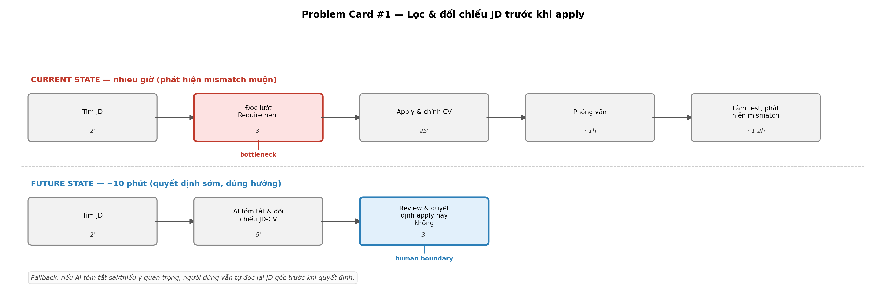
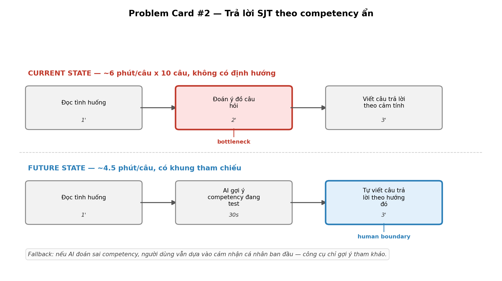
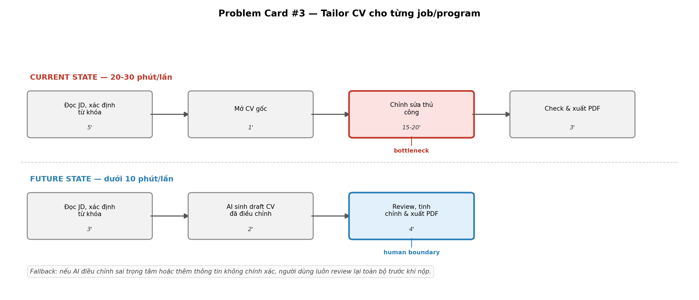

# 01 — Individual Problem Scan

> Điền theo Phase 1 + Phase 2 trong `01-worksheet.md`. Tự scan trước, dùng AI sau để phản biện. Không copy ví dụ Weekly Report.

## Thông tin cá nhân

- Họ và tên: Nguyễn Ngọc Thái An
- Mã học viên: 2A202602462
- Vai trò / bối cảnh (VD: sinh viên năm X, intern PM, ...): Sinh viên vừa tốt nghiệp
- Công việc hằng tuần:
  - Đọc và lọc JD trên các nền tảng tuyển dụng
  - Chỉnh sửa CV/cover letter theo từng job
  - Làm bài test/vòng đánh giá của các chương trình tuyển dụng (VD: Vinamilk Management Trainee)
  - Theo dõi trạng thái các đơn đã apply

---

## Phase 1 — Scan 5+ problems (tối thiểu 5, khuyến khích 8-10)

**Cách điền:** mỗi dòng = việc gì + ai chịu + đo bằng gì. Cột `Dấu hiệu thật` bắt buộc có số: mất bao lâu (bấm giờ mấy lần), mấy lần/tuần, bao nhiêu người gặp, log/ticket/quote nào.

| # | Lăng kính (Lặp lại / Tốn thời gian / AI có thể tốt hơn / Pain từ người khác) | Problem quan sát được | Ai chịu ảnh hưởng? | Dấu hiệu thật (số + bằng chứng) |
|---|---|---|---|---|
| 1 | Lặp lại| 	Chỉnh sửa lại CV cho từng job/program để khớp JD | Bản thân | Tháng trước apply 8 job + 2 program = 10 lần chỉnh CV, mỗi lần ~20-30 phút → tổng ~200-300 phút (3.5-5 giờ)/tháng chỉ để tailor CV |
| 2 | Tốn thời gian | Đọc JD tập trung nhiều vào phần Requirement, ít quan tâm phần Description/Responsibilities vì nghĩ đã match chuyên ngành | Bản thân | 30% trường hợp dù pass CV + phỏng vấn nhưng đến vòng test mới nhận ra công việc không hợp với định hướng hiện tại |
| 3 | AI có thể tốt hơn | Không có bước tóm tắt JD đầy đủ (cả Requirement lẫn Description) rồi so với CV/kỳ vọng bản thân trước khi quyết định apply | Bản thân | Hệ quả trực tiếp của dòng #2: 30% mismatch phát hiện muộn (ở vòng test) thay vì phát hiện sớm (ở bước đọc JD) |
| 4 | AI có thể tốt hơn| Trả lời phỏng vấn behavioral (kiểu STAR) dựa trên kinh nghiệm project — chưa rõ hiện đang chuẩn bị thế nào| Bản thân | Program Vinamilk: 10 câu xử lý tình huống theo góc nhìn 1 vị trí. Khó nhất ở chỗ không đoán được nhà tuyển dụng đang chấm điểm dựa trên tiêu chí gì |
| 5 | Pain từ chính mình (thói quen) | Theo dõi trạng thái apply bằng note tay/trí nhớ vì thấy Notion/Excel mất thời gian, không quen dùng | Bản thân | Từng 2 lần quên deadline của chương trình trại hè vì lịch học quá bận|
| 6 | AI có thể tốt hơn| Chủ động tra Glassdoor trước khi phỏng vấn nhưng thông tin review quá ít/chưa cập nhật, không phản ánh được tình hình thực tế công ty tại thời điểm apply | Bản thân | 1 case cụ thể: đã chủ động search Glassdoor trước phỏng vấn, không thấy cảnh báo gì → sau phỏng vấn mới biết (qua người quen nội bộ) công ty đang nợ lương/chậm lương/không giao task|


> Gợi ý tự soi: tuần trước mất nhiều thời gian nhất vào việc gì? Việc gì hay trì hoãn? Người khác hay hỏi lại câu gì? Workflow nào ai cũng biết là chậm?

**AI đã dùng ở Phase 1:**
- Prompt đã hỏi: Thảo luận với AI (Claude) để soi lại từng problem, kiểm tra xem có đủ số liệu/bằng chứng thật hay chỉ là quan sát chung chung
- Ý dùng được: Tách rõ "hiện tượng" (đọc sót JD) và "nguyên nhân gốc" (thiếu bước đối chiếu) thành 2 dòng riêng để dễ xác định bottleneck; làm rõ bottleneck thật của case Glassdoor là "nguồn thông tin không đủ" chứ không phải "lười tra cứu"
- Ý bỏ vì không phải pain thật: Ban đầu định thêm dòng "các bẫy trong JD" dựa trên cảnh báo thấy trên mạng (secondary info, không phải trải nghiệm cá nhân) — sau đó sửa lại thành case thật của bản thân (#6)

**Self-check Phase 1:**
- [x] Đủ 5+ dòng, mỗi dòng có actor + số đo cụ thể
- [x] Dùng ít nhất 3/4 lăng kính
- [x] Không có dòng chung chung kiểu "mất nhiều thời gian"

---

## Phase 2 — Top 3 Problem Cards

### 2.1. Chọn top 3

| Rank | Problem (copy từ bảng scan) | Vì sao chọn (2-3 ý) | Điều còn chưa chắc |
|---|---|---|---|
| 1 | Lọc/đối chiếu JD trước khi apply | Impact đo được rõ nhất, bottleneck nằm gọn ở 1 bước là đọc JD, workflow vẽ được dễ dàng | Chưa biết chính xác trong những lần apply có bao nhiêu lần rơi vào mismatch |
| 2 | Trả lời SJT theo competency ẩn | Vấn đề không nằm ở việc không biết trả lời mà là không giải mã được tiêu chí chấm điểm. Có case cụ thể như khi ứng cử viên làm bài test của program Vinamilk | Chưa rõ liệu các công ty/chương trình khác có cùng dạng SJT không, hay đây là case riêng của 1-2 chương trình |
| 3 | Tailor CV cho từng job/program | Số liệu định lượng mạnh nhất và dễ verify (10 lần, 20-30p/lần), pain lặp lại đều đặn mỗi lần apply | Chưa chắc 20-30 phút là do thiếu công cụ hay do quy trình cá nhân chưa tối ưu |

### 2.2. Problem Cards chi tiết

---

#### Problem Card #1 — Lọc & đối chiếu JD trước khi apply

```text
Problem 1 câu:
Một số sinh viên khi apply job chỉ đọc phần Requirement của JD, bỏ qua Description/Responsibilities, dẫn đến apply nhầm job không khớp kỳ vọng bản thân, chỉ phát hiện ra ở vòng test.

Actor:
Sinh viên đang chủ động apply việc

Thời điểm / bối cảnh:
Giai đoạn tìm việc sau tốt nghiệp, khi lướt nhiều JD trên các platform tuyển dụng trong thời gian ngắn, ưu tiên tốc độ hơn độ kỹ

Current workflow:
1. Tìm JD trên platform tuyển dụng (LinkedIn, TopCV, hay group FB)
2. Đọc lướt phần Requirement — thấy khớp chuyên ngành/kỹ năng → quyết định apply
3. Chỉnh CV theo JD, nộp đơn
4. Qua vòng CV, phỏng vấn trực tiếp/online
5. Làm bài test/vòng đánh giá thực tế của công việc
6. Có khả năng nhận ra: Nội dung công việc thực tế phản ánh qua bài test không khớp như mình nghĩ

Bottleneck:
Bước 2 — đọc JD chỉ tập trung Requirement, không đối chiếu đầy đủ Description/Responsibilities với kỳ vọng bản thân trước khi quyết định apply

Impact:
Tốn công apply + chuẩn bị phỏng vấn + làm test cho job không phù hợp (mỗi lần tốn ít nhất vài giờ tổng cộng cho các bước 3-5)

Success metric:
Giảm tỷ lệ mismatch phát hiện muộn (ở vòng test) xuống dưới 10%, tức là phát hiện được sự không khớp ngay từ bước đọc JD (bước 2) thay vì bước 5

Non-AI alternative:
Tự đặt checklist cá nhân (5-7 câu hỏi cố định) để tự trả lời trước khi apply mỗi JD, ví dụ như công việc hằng ngày thực chất là gì hay có đúng công nghệ/kỹ năng mình muốn
phát triển không.

AI hypothesis:
AI đọc toàn bộ JD (không chỉ Requirement), tóm tắt lại thành: (a) yêu cầu thực sự,
(b) công việc hằng ngày cụ thể, (c) so sánh nhanh với CV/kỳ vọng bản thân, (d) gắn cờ
cảnh báo nếu có điểm mơ hồ hoặc không khớp.

Quick gut:
[ ] No AI / process fix
[x] Workflow
[ ] Rule
[ ] Agent
[ ] Chưa biết
```

**Draft workflow Card #1:**



---

#### Problem Card #2 — Trả lời SJT theo competency ẩn

```text
Problem 1 câu:
Khi làm bài test tình huống (SJT) trong vòng đánh giá của chương trình tuyển dụng, fresh grad không biết nhà tuyển dụng đang chấm điểm dựa trên tiêu chí/competency nào, dẫn đến trả lời theo cảm tính thay vì có khung tham chiếu.

Actor:
Sinh viên tham gia chương trình tuyển dụng có vòng test tình huống (VD: Management Trainee)

Thời điểm / bối cảnh:
Vòng test online của chương trình, sau khi đã qua vòng CV, thường có giới hạn thời gian làm bài

Current workflow:
1. Nhận đề bài SJT — mỗi câu mô tả 1 tình huống + yêu cầu nhập vai 1 vị trí cụ thể
2. Đọc tình huống, cố hiểu ngữ cảnh
3. Tự đoán "câu trả lời đúng" nên là gì mà không có khung tham chiếu rõ ràng
4. Viết câu trả lời theo cảm tính/trực giác
5. Lặp lại cho 10 câu, không biết mình đang bị đánh giá điểm mạnh/yếu nào

Bottleneck:
Bước 3 — không giải mã được competency ẩn (leadership, teamwork, ra quyết định...) mà câu hỏi đang nhắm tới, nên không có cơ sở để chọn hướng trả lời phù hợp

Impact:
Chương trình Vinamilk: 10 câu tình huống mỗi lần test — toàn bộ 10 câu đều bị ảnh hưởng bởi việc thiếu khung tham chiếu này (không phải lỗi rải rác mà là lỗi hệ thống
trong cách tiếp cận)

Success metric:
Trước khi trả lời mỗi câu, xác định được rõ 1-2 competency chính đang được test, từ đó trả lời có định hướng thay vì đoán mò

Non-AI alternative:
Tự nghiên cứu trước các khung competency phổ biến trong tuyển dụng và luyện tập nhận diện qua các bộ câu hỏi SJT mẫu có sẵn trên mạng

AI hypothesis:
AI phân tích cấu trúc câu hỏi SJT (dựa trên các mẫu SJT phổ biến), gợi ý competency khả năng cao đang được nhắm tới, kèm 1 khung trả lời gợi ý (không đưa đáp án có sẵn, mà đưa "lăng kính" để tự trả lời cho đúng hướng)

Quick gut:
[ ] No AI / process fix
[x] Rule
[ ] Workflow
[ ] Agent
[ ] Chưa biết
```

**Draft workflow Card #2:**



---

#### Problem Card #3 — Tailor CV cho từng job/program

```text
Problem 1 câu:
Sinh viên thường mất 20-30 phút mỗi lần chỉnh sửa lại CV cho khớp từng JD cụ thể, lặp lại đều đặn với mỗi lần apply.

Actor:
Sinh viên đang trong giai đoạn apply nhiều job/program cùng lúc

Thời điểm / bối cảnh:
Tháng cao điểm apply việc, khi cần nộp đơn cho nhiều vị trí khác nhau trong thời gian ngắn

Current workflow:
1. Đọc JD, xác định từ khóa/kỹ năng cần nhấn mạnh
2. Mở file CV gốc (master CV)
3. Chỉnh sửa thứ tự, từ ngữ, nhấn mạnh kinh nghiệm/skill cho khớp JD
4. Kiểm tra lại format, chính tả
5. Xuất file PDF, nộp đơn

Bottleneck:
Bước 3 — chỉnh sửa thủ công từng phần nội dung CV để khớp JD, không có template/hệ thống hỗ trợ nên phải làm lại gần như từ đầu mỗi lần

Impact:
Nếu 10 lần chỉnh CV/tháng, mỗi lần 20-30 phút thì tổng thời gian cần dùng khoảng 3.5-5 giờ/tháng chỉ để tailor CV, chưa tính thời gian cho cover letter (nếu có).

Success metric:
Giảm thời gian tailor CV mỗi lần xuống dưới 10 phút, tổng thời gian/tháng giảm còn dưới 1.5-2 giờ

Non-AI alternative:
Chuẩn bị sẵn 2-3 phiên bản CV theo nhóm ngành/vị trí để giảm số lần chỉnh từ đầu

AI hypothesis:
AI đọc JD + CV master, tự động gợi ý phần nào cần nhấn mạnh/sắp xếp lại, sinh ra bản draft CV đã điều chỉnh để người dùng chỉ cần review và tinh chỉnh nhẹ thay vì viết lại từ đầu

Quick gut:
[ ] No AI / process fix
[ ] Rule
[x] Workflow
[ ] Agent
[ ] Chưa biết
```

**Draft workflow Card #3:**



---

### 2.3. Card muốn pitch nhất

**Card tôi muốn pitch nhất:**
Problem Card #1 — Lọc & đối chiếu JD trước khi apply


**Vì sao (2-3 câu):**
Đây là bottleneck ở đầu funnel apply — nếu giải quyết được, sẽ giảm được lãng phí
công sức ở tất cả các bước phía sau (phỏng vấn, làm test) cho những job không thực
sự phù hợp. Impact đo được rõ ràng: 30% trong 10 lần apply gần nhất bị phát hiện
mismatch muộn, nghĩa là gần 1/3 công sức apply có thể đã bị đặt sai chỗ ngay từ đầu.

**Câu hỏi tôi muốn nhóm challenge:**

1. Làm sao AI phân biệt được đâu là "mismatch thật" (công việc không phù hợp) và
   đâu là "JD mô tả mơ hồ, tự công ty cũng chưa rõ vị trí cần gì" — 2 trường hợp
   này cần cách xử lý khác nhau?
2. Nếu tóm tắt JD của AI giúp người dùng loại bỏ sớm 1 job, làm sao chắc chắn AI
   không loại nhầm những job thực ra vẫn phù hợp (false negative)?

**AI phản biện Card (nếu có):**
- Điểm yếu AI chỉ ra: Con số "30% mismatch" hiện tại chỉ là ước tính cá nhân, chưa
  đếm lại chính xác trong 10 lần apply gần nhất có bao nhiêu case cụ thể
- Tôi sửa gì: Cần liệt kê lại chính xác 8 job + 2 program đã apply, đánh dấu case
  nào thực sự rơi vào mismatch trước khi trình bày số liệu này khi pitch

### Self-check nộp phần 01
- [x] Có 5+ problems + top 3 Cards đủ field
- [x] Mỗi Card có workflow trước/sau + bottleneck + metric + fallback
- [x] Đã chọn 1 card pitch + câu hỏi challenge